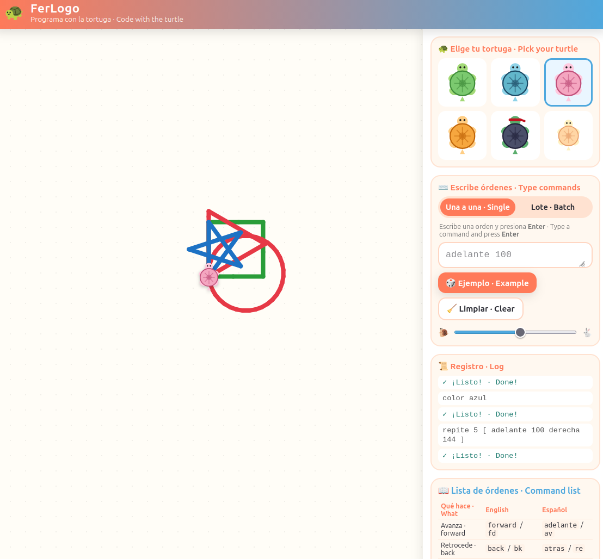

# 🐢 FerLogo

Un divertido patio de juegos de **Logo** (gráficos de tortuga) para niños, que funciona en el
navegador. Escribe una orden, presiona **Enter** y mira a la tortuga caminar por la pantalla
dibujando a su paso.

Las órdenes funcionan en **inglés *y* español al mismo tiempo** — ideal para niños bilingües.

> 🇬🇧 *Prefer English?* → [**README.en.md**](README.en.md)

### ▶️ Jugar ahora · Play now

**👉 [juantoledo.github.io/ferlogo](https://juantoledo.github.io/ferlogo/)**

_(Se ejecuta en el navegador, sin instalar nada · Runs in the browser, nothing to install.
Requiere activar GitHub Pages en el repositorio · needs GitHub Pages enabled for the repo.)_



## ✨ Una pequeña historia

Cuando tenía **7 años** conocí Logo por primera vez en un **Atari 800 XL**, escribiendo
`FORWARD` y `RIGHT` para mover una tortuga y sintiendo la magia de decirle a una computadora
qué hacer. FerLogo es mi pequeño homenaje a ese momento — una versión moderna y bilingüe para
que una nueva generación de niños descubra la misma alegría.

## 🚀 Cómo ejecutarlo

Sin instalación, sin compilar, sin servidor. Solo **abre `index.html`** en cualquier navegador
(haz doble clic, o arrástralo a una ventana del navegador).

```bash
xdg-open index.html      # Linux
open index.html          # macOS
start index.html         # Windows
```

## 🎮 Cómo jugar

1. **Elige una tortuga** — escoge entre nueve tortugas SVG (verde, azul, rosa, naranja, ninja, bebé, galáctica, arcoíris, robot).
2. **Escribe una orden** en la barra lateral y presiona **Enter** — se ejecuta de inmediato.
3. ¿Quieres escribir un programa completo? Cambia al modo **Lote / Batch**, escribe varias líneas
   y presiona **▶ Ejecutar / Run**.
4. Toca **🎲 Ejemplo / Example** para dibujos listos, **🧹 Limpiar / Clear** para empezar de nuevo,
   y usa el **control de velocidad 🐌 → 🐇** para que la tortuga camine lento o rápido.

## 📖 Órdenes (español e inglés)

> 🖨️ **¿Para imprimir?** Abre [**cheatsheet.html**](cheatsheet.html) en el navegador y pulsa
> *Imprimir* — muestra cada figura dibujada de verdad y con colores. (También hay una versión
> de solo texto en [cheatsheet.md](cheatsheet.md).) · Open `cheatsheet.html` and print it; it
> shows every shape really drawn, in color.

> Las órdenes se escriben en MAYÚSCULAS (como las teclas del teclado). También funcionan en
> minúsculas · Commands are shown in UPPERCASE to match the keyboard keys; lowercase works too.

| Qué hace | Español | English |
|---|---|---|
| Avanzar | `ADELANTE` / `AV` | `FORWARD` / `FD` |
| Retroceder | `ATRAS` / `RE` | `BACK` / `BK` |
| Girar a la derecha | `DERECHA` / `GD` | `RIGHT` / `RT` |
| Girar a la izquierda | `IZQUIERDA` / `GI` | `LEFT` / `LT` |
| Subir el lápiz (no dibuja) | `SUBELAPIZ` / `SL` | `PENUP` / `PU` |
| Bajar el lápiz (dibuja) | `BAJALAPIZ` / `BL` | `PENDOWN` / `PD` |
| Cambiar el color | `COLOR ROJO` | `COLOR RED` |
| Cambiar el grosor | `GROSOR 5` | `WIDTH 5` |
| Limpiar la pizarra | `LIMPIA` / `BORRA` | `CLEAR` / `CS` |
| Ir al centro | `CASA` | `HOME` |
| Ocultar la tortuga | `OCULTA` / `OT` | `HIDETURTLE` / `HT` |
| Mostrar la tortuga | `MUESTRA` / `MT` | `SHOWTURTLE` / `ST` |
| Repetir un bloque | `REPITE 4 [ ... ]` | `REPEAT 4 [ ... ]` |

### 🔷 Figuras · Figures

Dibuja figuras completas con una sola orden (usan el color y grosor actuales):

Cada figura tiene una forma corta · Each figure has a short form: `CI CU TR RC PG ES`.

| Figura | Español | English | Corta · Short |
|---|---|---|---|
| Círculo (radio) | `CIRCULO 60` | `CIRCLE 60` | `CI 60` |
| Cuadrado (lado) | `CUADRADO 80` | `SQUARE 80` | `CU 80` |
| Triángulo (lado) | `TRIANGULO 90` | `TRIANGLE 90` | `TR 90` |
| Rectángulo (ancho alto) | `RECTANGULO 120 60` | `RECTANGLE 120 60` | `RC 120 60` |
| Polígono (lados lado) | `POLIGONO 6 60` | `POLYGON 6 60` | `PG 6 60` |
| Estrella (tamaño) | `ESTRELLA 120` | `STAR 120` | `ES 120` |

**Colores:** ROJO/RED, AZUL/BLUE, VERDE/GREEN, AMARILLO/YELLOW, NARANJA/ORANGE,
MORADO/PURPLE, ROSA/PINK, NEGRO/BLACK, MARRON/BROWN, BLANCO/WHITE, GRIS/GRAY,
TURQUESA/TURQUOISE, LIMA/LIME — o cualquier hex como `#FF0000`.

No importan las mayúsculas ni los acentos: `ATRÁS`, `ATRAS` y `atras` funcionan igual.

### Prueba esto 👇

```
COLOR ROJO
CIRCULO 70                                # un círculo rojo
ESTRELLA 120                              # una estrella
POLIGONO 6 60                             # un hexágono
REPITE 6 [ CIRCULO 50 DERECHA 60 ]        # una flor de círculos
```

## 🛠️ Cómo está hecho

Un único archivo `index.html` autónomo:

- **JavaScript puro** — sin frameworks, sin dependencias.
- Un **`<canvas>`** de HTML5 guarda el dibujo; la tortuga es un **SVG** que se mueve y gira con
  transformaciones CSS, para que se vea nítida y se anime con suavidad.
- Un pequeño tokenizador → analizador recursivo (que expande `repite`/`repeat` anidados y las
  figuras como `circulo` o `cuadrado` en órdenes básicas de avanzar/girar) → una cola de animación
  que se vacía con `requestAnimationFrame` para que los niños *vean* cada paso.

## 💛 Licencia

Hecho con cariño para niños curiosos. Úsalo, compártelo, modifícalo.
